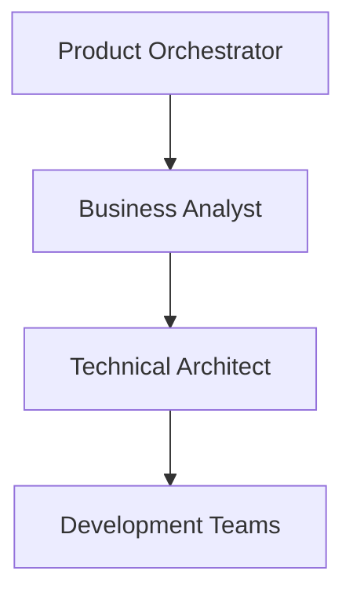
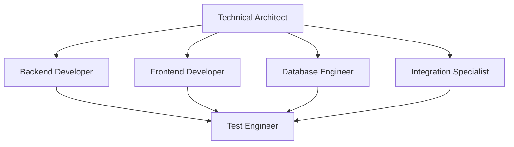
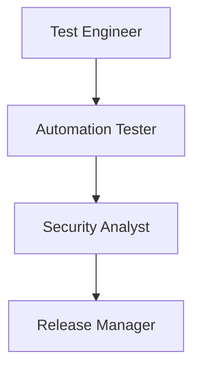
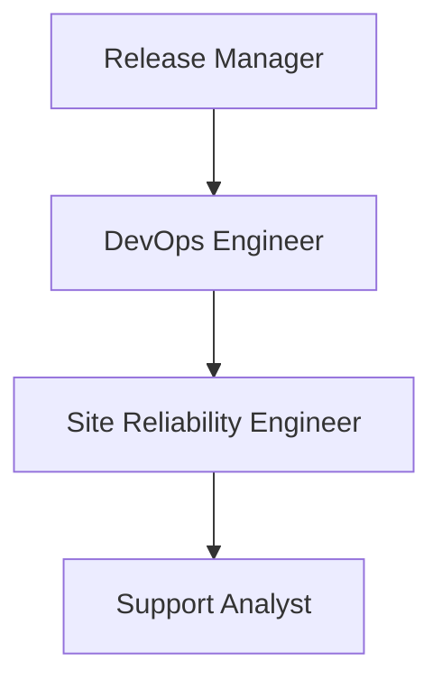
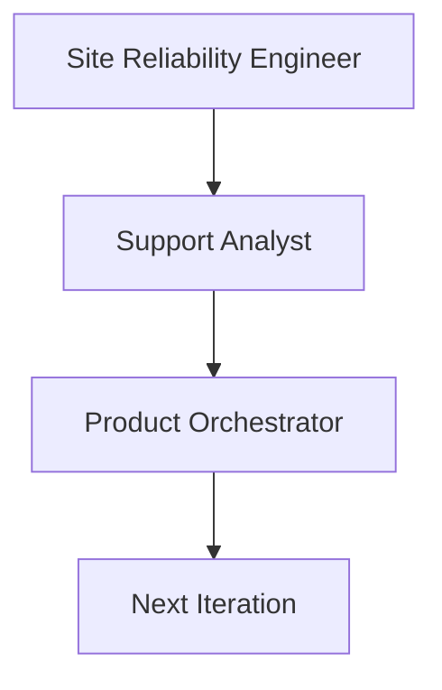

# Complete Development Workflow

## Overview
This document describes the integrated workflow between all agents in the agentic-visor system, covering the complete software development lifecycle from epic creation to production support.

## Workflow Phases

### Phase 1: Planning & Requirements (Days 1-3)

**1. Epic Creation & Breakdown**
- **product-orchestrator** creates epics from business requirements
- Breaks epics into user stories with acceptance criteria
- Assigns priorities and estimates

**2. Requirements Analysis**
- **business-analyst** analyzes user stories
- Creates detailed functional specifications
- Defines business logic and processes

**3. Technical Architecture**
- **technical-architect** reviews requirements
- Designs system architecture and technical approach
- Defines APIs, data models, and integration patterns

### Phase 2: Development (Days 4-10)

**4. Parallel Development**
- **backend-developer** implements APIs and business logic
- **frontend-developer** creates user interfaces
- **database-engineer** implements data models and optimizations
- **integration-specialist** handles external API integrations

**5. Development Testing**
- **test-engineer** creates test cases for each component
- Performs manual testing as development progresses
- Validates acceptance criteria

### Phase 3: Testing & Quality Assurance (Days 11-13)

**6. Comprehensive Testing**
- **test-engineer** executes full regression testing
- **automation-tester** runs automated test suites
- **security-analyst** performs security testing and vulnerability assessment

**7. Quality Gates**
- All tests must pass before proceeding
- Security clearance required
- Performance benchmarks must be met

### Phase 4: Deployment & Operations (Days 14-15)

**8. Release Preparation**
- **release-manager** coordinates release activities
- **devops-engineer** prepares deployment infrastructure
- Final release readiness review

**9. Production Deployment**
- **devops-engineer** executes deployment
- **site-reliability-engineer** monitors deployment
- **support-analyst** prepared for post-release support

### Phase 5: Monitoring & Support (Ongoing)

**10. Production Monitoring**
- **site-reliability-engineer** monitors system health
- **support-analyst** handles user issues and feedback
- Continuous improvement and next iteration planning

## Agent Interaction Matrix

| Agent | Receives From | Collaborates With | Provides To | Reports To |
|-------|---------------|-------------------|-------------|-------------|
| product-orchestrator | Stakeholders | business-analyst | All teams | Business |
| business-analyst | product-orchestrator | technical-architect | Development teams | release-manager |
| technical-architect | business-analyst | All dev teams | Development teams | release-manager |
| backend-developer | technical-architect | database-engineer, integration-specialist | test-engineer | release-manager |
| frontend-developer | technical-architect | backend-developer | test-engineer | release-manager |
| database-engineer | technical-architect | backend-developer | devops-engineer | release-manager |
| integration-specialist | technical-architect | backend-developer, security-analyst | test-engineer | release-manager |
| test-engineer | All dev teams | automation-tester | release-manager | release-manager |
| automation-tester | test-engineer | devops-engineer | release-manager | release-manager |
| security-analyst | All dev teams | integration-specialist | release-manager | release-manager |
| devops-engineer | All dev teams | site-reliability-engineer | site-reliability-engineer | release-manager |
| release-manager | All agents | All agents | Stakeholders | Business |
| site-reliability-engineer | devops-engineer | support-analyst | All teams | release-manager |
| support-analyst | Users | All teams | product-orchestrator | release-manager |

## Communication Protocols

### Daily Communications
- Each agent reports progress to **release-manager**
- Blockers and dependencies are immediately escalated
- Cross-team collaboration is facilitated by **release-manager**

### Quality Gates
1. **Requirements Sign-off**: business-analyst → technical-architect
2. **Architecture Review**: technical-architect → development teams
3. **Development Complete**: all dev teams → test-engineer
4. **Testing Complete**: test-engineer + automation-tester + security-analyst → release-manager
5. **Deployment Ready**: devops-engineer → release-manager
6. **Production Stable**: site-reliability-engineer → release-manager

### Escalation Paths
- Technical issues: Developer → technical-architect → release-manager
- Quality issues: test-engineer → release-manager
- Security issues: security-analyst → release-manager (immediate)
- Production issues: site-reliability-engineer → release-manager (immediate)

## Success Criteria
- All user stories meet acceptance criteria
- Code quality standards are met
- Security clearance obtained
- Performance benchmarks achieved
- Deployment successful with zero downtime
- Post-release monitoring shows stable system